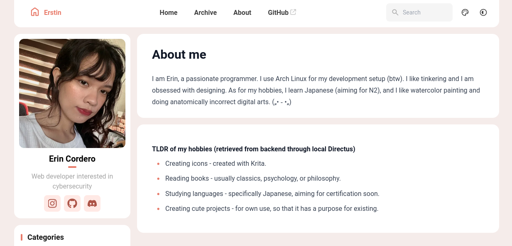
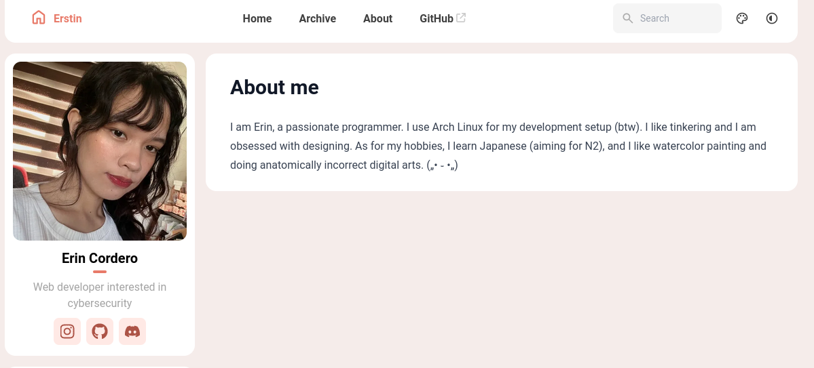

<h2>Notes</h2>

#### Directus integration

- [code fetching from directus](https://github.com/erstinn/fuwari-portfolio/blob/main/src/utils/portfolio-data-utils.ts)
- [code displaying the fetched directus data](https://github.com/erstinn/fuwari-portfolio/blob/main/src/pages/about.astro)
- as directus is only local, when locally deployed the data it would be fetch would be under [About] displaying :
  

- on vercel only: 
  

<h3>References</h3>

- Theme from astro; [fuwari](https://astro.build/themes/details/fuwari/)